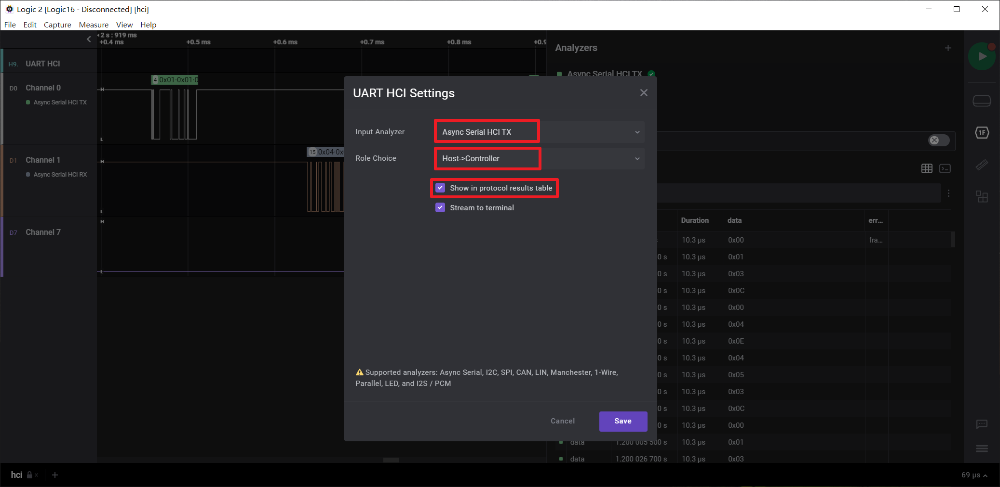

# Logic2_HCI_UART_Extension
A HCI uart extension for Saleae Logic 2, and a script convert exported data to btsnoop file.

# Working flow
UART_HCI foler include a Logic2 extension analyzer could findout HCI packets from uart stream, but the analyzer don't know the data direction, so the user need select the correct role for them. The analyzer result will shown in data table's data colume, and only the UART HCI's result should be keeped. Then you could export to a CSV file with ISO timestamp. Last, run csv2btsnoop.py script to convert the csv to btsnoop log file.

# Automation Script
There is a python scritp can automaticly capture and export btsnoop: `logic2_analyzer.py`

Install dependency: `pip install -r requirement`

Here below is a example:

```python
import time
from logic2_analyzer import Logic2_Analyzer

analyzer = Logic2_Analyzer()

analyzer.set_save_folder('./log')

analyzer.capture_config(digital_channels=[0, 1, 2, 3, 4, 5], 
                        digital_sample_rate=12500000)


analyzer.capture_start()
time.sleep(3)
analyzer.capture_stop()

analyzer.export_btsnoop('ums', tx_channel=0, rx_channel=1, bit_rate=3000000)
analyzer.export_btsnoop('umr', tx_channel=2, rx_channel=3, bit_rate=3000000)

analyzer.capture_save()

analyzer.close()
```

# How to use in logic2
## 1, Cauture HCI TX/RX data and decode them both with "Async Serial"


## 2, Use Logic2's "Load Existing Extesion" and open "Logic2_HCI_UART_Extension\HCI_UART\extension.json", then you will find "UART HCI" in your Analyzers.


## 3, Add two "UART HCI" analyzers and select right role for them "Host->Controller" or "Controller->Host" in "Role Choice"



## 4, Only keep the UART HCI's analyze data in data table


## 5, Export them both to CSV with "Use ISO8601 timestamps".


## 6, Run command "python csv2btsnoop.py hci.csv btsnoop.log" to get the btsnoop file. Or just drop csv file to csv2btsnoop.bat to generate btsnoop file.


## Now you could review the btsnoop log in Wireshark or any other tools.

